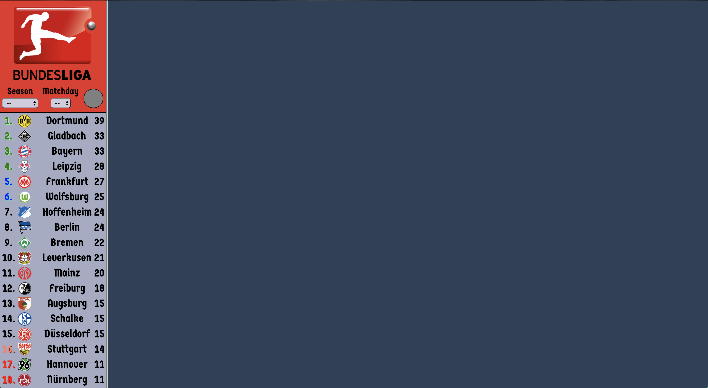
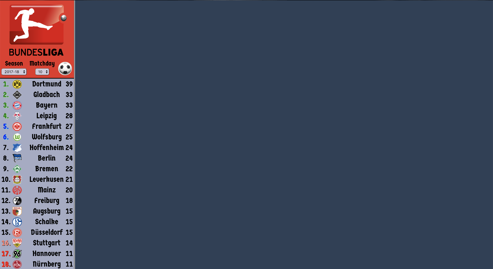
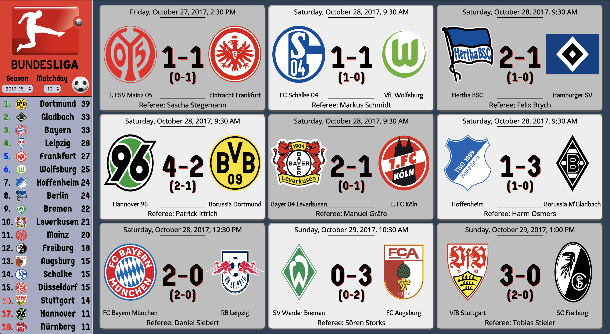
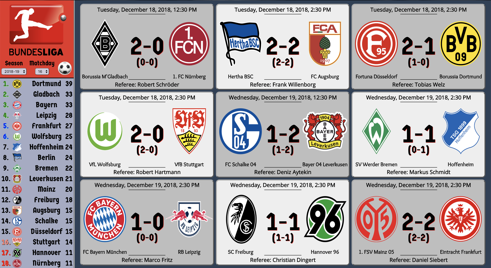

# bundesliga

An application that displays data about the Bundesliga, the premier soccer league in Germany.

New features will be added periodically!

Football data provided by the [Football-Data.org API](https://www.football-data.org/).

## Setup

In order to use the application, you will need an API key. Please follow these instructions:

1. In your terminal, navigate to the directory where you would like to place this application.
2. Clone this repository onto your local machine: `git clone https://github.com/aeolion7/bundesliga.git`.
3. In your terminal, navigate to the project directory and type `npm install`.
4. Sign up using the above link (it's free!) and you will be given an API key. It can be accessed at any time in the "My Account" tab.
5. Create a file in the top-level directory of this application called "secrets.js".
6. In secrets.js, paste the following line of code:
   `export const API_TOKEN = 'YOUR_API_TOKEN_HERE';`
7. In the terminal, type `npm run start-dev`.
8. In your browser, navigate to "localhost:3000".
9. Look at some German football data!

## Functionality

Upon starting the application, the application will load the current Bundesliga table for you.

Use the two drop-down menus to select a season and matchday of your choice. Currently the app can only load data from the 2017-18 and 2018-19 seasons. Once a season and matchday have been selected, a button will appear.

Click the button to load and view the data.

Different data can be viewed at any time by selecting a different season and/or matchday and clicking the button.

---

Technologies used: Node.js, Express.js, React.js, Redux.js, Webpack
